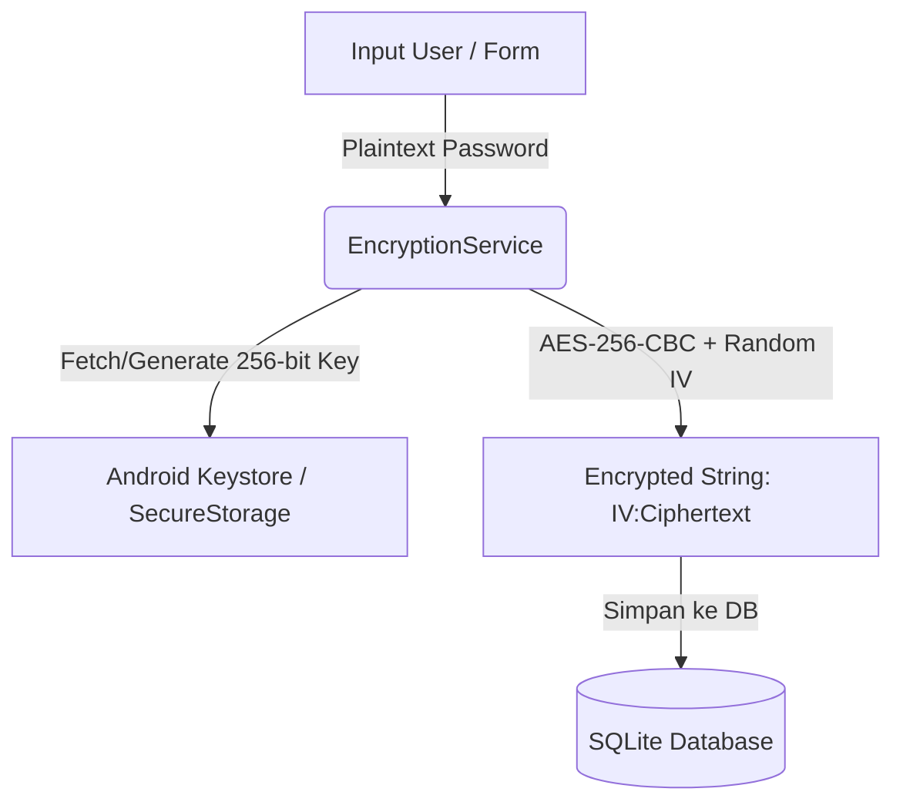

# 🔐 Laporan & Dokumentasi Presentasi UAS
## Mata Kuliah: Pemrograman Berbasis Perangkat Bergerak
**Program Studi S1 Sistem Informasi — Universitas Siber Asia (UNSIA)**

---

### 🎓 Informasi Mahasiswa & Proyek
- **Mata Kuliah**: Pemrograman Berbasis Perangkat Bergerak
- **Program Studi**: S1 Sistem Informasi
- **Perguruan Tinggi**: Universitas Siber Asia (UNSIA)
- **Nama Proyek**: Secure Password Manager Mobile Application
- **Teknologi**: Flutter & Dart (Android Platform)
- **Pola Arsitektur**: MVVM (Model-View-ViewModel) + Repository Pattern
- **Penyimpanan Data**: Local Database SQLite (`sqflite`) & Hardware Keystore (`flutter_secure_storage`)

---

## 📌 1. Ikhtisar Aplikasi (Executive Summary)

**Password Manager** adalah aplikasi mobile Android berbasis Flutter yang dibangun sebagai proyek Ujian Akhir Semester (UAS) untuk memecahkan masalah keamanan pengelolaan kredensial akun pengguna secara aman dan modern. Aplikasi mengadopsi prinsip *Zero-Cloud Trust Architecture* di mana semua data pengguna disimpan dan dienkripsi secara lokal tanpa bergantung pada server pihak ketiga.

- **Platform Target**: Android (Dart & Flutter)
- **Arsitektur**: MVVM (Model-View-ViewModel) + Repository Pattern
- **Penyimpanan Lokal**: SQLite Database (`sqflite`)
- **Tingkat Keamanan**: AES-256-CBC, Hardware Keystore, Hashed Master PIN (SHA-256 + Salt), FLAG_SECURE, Auto-Clear Clipboard

---

## 🛡️ 2. Fitur Keamanan Unggulan (Security Highlights)

Aplikasi ini dibangun dengan memprioritaskan keamanan data pengguna di atas segalanya:



1. **Enkripsi AES-256 Bit (CBC Mode)**
   - Semua password dienkripsi **sebelum** dimasukkan ke database SQLite.
   - Menggunakan **Random Initialization Vector (IV 128-bit)** untuk setiap entri, memastikan dua password identik menghasilkan ciphertext yang berbeda.
   - Kunci AES-256 disimpan di dalam **Hardware-backed Android Keystore** via `flutter_secure_storage`.
2. **Master PIN Authentication (SHA-256 + Salt)**
   - Saat pertama kali menggunakan app, pengguna wajib membuat Master PIN.
   - Master PIN tidak pernah disimpan dalam format teks mentah, melainkan di-hash menggunakan **SHA-256 + Salt acak** unik berbasis waktu.
3. **Anti-Screenshot & Anti-Screen Recording (`FLAG_SECURE`)**
   - Menggunakan flag bawaan Android OS (`WindowManager.LayoutParams.FLAG_SECURE`) pada `MainActivity.kt`.
   - Layar aplikasi akan otomatis menghitam ketika pengguna mengambil screenshot, screen recording, atau saat beralih di layar Recent Apps.
4. **Auto-Lock Timeout saat Inaktif**
   - Aplikasi mendeteksi interaksi pengguna (*touch/move*). Jika tidak ada interaksi selama **3 menit** atau aplikasi di-minimised (background), brankas password otomatis terkunci kembali.
5. **Auto-Clear Clipboard (30 Detik)**
   - Fitur *Copy to Clipboard* untuk Username & Password dilengkapi *timer* otomatis yang akan menghapus data di clipboard OS Android setelah 30 detik demi mencegah pencurian data dari clipboard history.

---

## 🚀 3. Fitur Utama Aplikasi (Core Features)

| Fitur | Deskripsi |
| :--- | :--- |
| 🔑 **Master PIN Screen** | Layar pembuatan Master PIN (saat registrasi awal) & otentikasi login wajib setiap kali membuka aplikasi. |
| 📋 **CRUD Password Vault** | Tambah, lihat, ubah, dan hapus entri akun (Nama Layanan, Username/Email, Password, Catatan). |
| 🔍 **Real-time Search Bar** | Fitur pencarian cepat berdasar nama layanan atau username. |
| 👁️ **Show/Hide Password Toggle** | Tombol mata untuk menyembunyikan/menampilkan password terdekripsi. |
| 🎲 **Password Generator** | Pembuat password acak yang fleksibel (opsi panjang 6–32 karakter, kombinasi huruf kapital, huruf kecil, angka, dan simbol). |
| 📋 **Safe Clipboard Copy** | Tombol sekali tekan untuk menyalin username & password dengan auto-clear 30 detik. |

## 🖼️ 4. Pratinjau Layar Aplikasi (Screen Previews & UI Mockup)

Berikut adalah gambaran struktur UI dan tampilan visual dari setiap layar utama aplikasi:

### 1. Layar Master PIN (Login & Registrasi Awal)
Layanan keamanan pertama saat membuka aplikasi. Jika pengguna belum mendaftarkan Master PIN, sistem meminta konfirmasi PIN baru.

```
+---------------------------------------------------+
|                                                   |
|                    [ 🔒 ]                         |
|             Buat Master PIN Baru                  |
|  PIN ini digunakan untuk mengamankan & mengakses   |
|               semua password Anda.                |
|                                                   |
|                 [  • • • • • •  ]                 |
|            [ Konfirmasi Master PIN ]              |
|                                                   |
|            +-------------------------+            |
|            |   Simpan Master PIN     |            |
|            +-------------------------+            |
|                                                   |
+---------------------------------------------------+
```

---

### 2. Layar Utama Brankas Password (Vault Home Screen)
Daftar entri password tersimpan dilengkapi bar pencarian real-time, toggle mata (show/hide), dan tombol salin cepat.

```
+---------------------------------------------------+
| Password Vault                           🪄  🔒  |
+---------------------------------------------------+
| 🔍  Cari layanan atau username...                 |
+---------------------------------------------------+
| [G]  Google                                    V  |
|      user@gmail.com                               |
|      Password: ••••••••••••          👁️  📋       |
|      Username: user@gmail.com            📋       |
|      Catatan: Akun Utama                          |
|      -------------------------------------------  |
|                                [ Edit ]  [ Hapus ]|
+---------------------------------------------------+
| [N]  Netflix                                   >  |
|      family@netflix.com                           |
+---------------------------------------------------+
|                                 + Tambah Entri    |
+---------------------------------------------------+
```

---

### 3. Dialog Generator Password (Password Generator)
Modul untuk membuat password acak dengan kombinasi dinamis (Huruf Besar/Kecil, Angka, Simbol, dan Slider Panjang).

```
+---------------------------------------------------+
| Password Generator                                |
+---------------------------------------------------+
|  [ K9#mP2$xL8!vQ4zW ]                     🔄      |
|                                                   |
|  Panjang: 16                                      |
|  [-------O----------------] 6 - 32                |
|                                                   |
|  [x] Huruf Kecil (a-z)                            |
|  [x] Huruf Besar (A-Z)                            |
|  [x] Angka (0-9)                                  |
|  [x] Simbol (!@#$)                                |
|                                                   |
|            [ Batal ]  [ 📋 Salin & Pakai ]        |
+---------------------------------------------------+
```

---

### 4. Dialog Form Tambah / Edit Entri
Form input data akun lengkap dengan akses langsung ke Password Generator (tombol 🪄).

```
+---------------------------------------------------+
| Tambah Entri Password Baru                        |
+---------------------------------------------------+
| 🌐 Nama Layanan / Website                         |
|    [ Google                             ]         |
| 👤 Username / Email                               |
|    [ user@gmail.com                     ]         |
| 🔒 Password                                       |
|    [ ••••••••••••••••             👁️  🪄 ]         |
| 📝 Catatan (Opsional)                             |
|    [ Akun Gmail Utama                   ]         |
|                                                   |
|            [ Batal ]   [ Tambah ]                 |
+---------------------------------------------------+
```

---

## 🏗️ 5. Arsitektur Software (MVVM Pattern)

Aplikasi menerapkan pola arsitektur **MVVM** yang bersih (*Clean Code Architecture*) untuk memisahkan logika bisnis dari UI:

```
lib/
├── core/                       # Utilities & Core Security
│   ├── security/
│   │   └── encryption_service.dart   # Service Enkripsi & Hashing
│   └── utils/
│       ├── clipboard_service.dart    # Auto-clear Clipboard Handler
│       └── password_generator.dart   # Generator Password Logik
├── data/                       # Layer Data & Persistence
│   ├── datasources/
│   │   └── database_helper.dart      # SQLite Database Helper
│   └── repositories/
│       ├── auth_repository.dart      # Repository Master PIN
│       └── password_repository.dart  # Repository CRUD & Crypto Bridge
├── domain/                     # Business Entities
│   └── models/
│       └── password_entry.dart       # Entity Model PasswordEntry
├── ui/                         # User Interface Layer (Views & ViewModels)
│   ├── screens/
│   │   ├── home_screen.dart          # Vault View
│   │   └── pin_screen.dart           # Login / PIN Setup View
│   ├── viewmodels/
│   │   ├── auth_viewmodel.dart       # State Otentikasi & Lock
│   │   └── password_viewmodel.dart   # State CRUD & Filtering
│   └── widgets/                      # Modular UI Components
│       ├── entry_form_dialog.dart    # Dialog Form Create/Edit
│       ├── generator_dialog.dart     # Dialog UI Password Generator
│       └── password_tile.dart        # Item List Password Card
└── main.dart                   # Application Root & Lifetime Watcher
```

---

## 🗄️ 5. Skema Database SQLite

Tabel utama: `passwords`

```sql
CREATE TABLE passwords (
    id TEXT PRIMARY KEY,
    service_name TEXT NOT NULL,
    username TEXT NOT NULL,
    encrypted_password TEXT NOT NULL,
    notes TEXT,
    created_at TEXT NOT NULL,
    updated_at TEXT NOT NULL
);
```

> ⚠️ **Catatan**: Kolom `encrypted_password` hanya menyimpan string dengan format `IV_BASE64:CIPHERTEXT_BASE64`.

---

## 💻 6. Panduan Demonstrasi Presentasi (Demo Flow)

Saat mempresentasikan aplikasi kepada audiens / penguji, ikuti alur demo berikut:

1. **Demo Registrasi PIN Awal**:
   - Tunjukkan layar pertama kali buka aplikasi. Buat Master PIN 6 digit (misal: `123456`).
2. **Demo Tambah Password dengan Generator**:
   - Tekan tombol `+ Tambah Entri`.
   - Isi Layanan (`Google`), Username (`user@gmail.com`).
   - Klik ikon tongkat sihir 🪄 untuk membuka **Password Generator**. Atur panjang karakter & kombinasi, lalu klik *Salin & Pakai*.
3. **Demo Fitur Show/Hide & Copy**:
   - Tunjukkan daftar entri tersimpan yang tertutup bintang `••••••••••••`.
   - Klik ikon **Mata** untuk mendekripsi & menampilkan password secara aman.
   - Klik ikon **Copy Password** dan tunjukkan notifikasi *"Auto-clear dalam 30 detik"*.
4. **Demo Keamanan Anti-Screenshot**:
   - Coba ambil screenshot di HP / Emulator. Tunjukkan bahwa OS Android menolak screenshot demi keamanan data.
5. **Demo Auto-Lock**:
   - Tekan tombol **Kunci Brankas** (ikon gembok di AppBar) atau minimize aplikasi, tunjukkan bahwa aplikasi langsung kembali ke layar PIN.

---

## 📦 7. Teknologi & Library yang Terlibat

- **Framework**: Flutter SDK ^3.13.0
- **State Management**: `provider: ^6.1.1`
- **Local Database**: `sqflite: ^2.3.0` & `path: ^1.8.3`
- **Cryptography**: `encrypt: ^5.0.3` & `crypto: ^3.0.3`
- **Secure Key Storage**: `flutter_secure_storage: ^9.0.0`
- **Unique Identifier**: `uuid: ^4.3.3`

---

*Dokumen ini dibuat untuk melengkapi presentasi proyek Password Manager App.*
